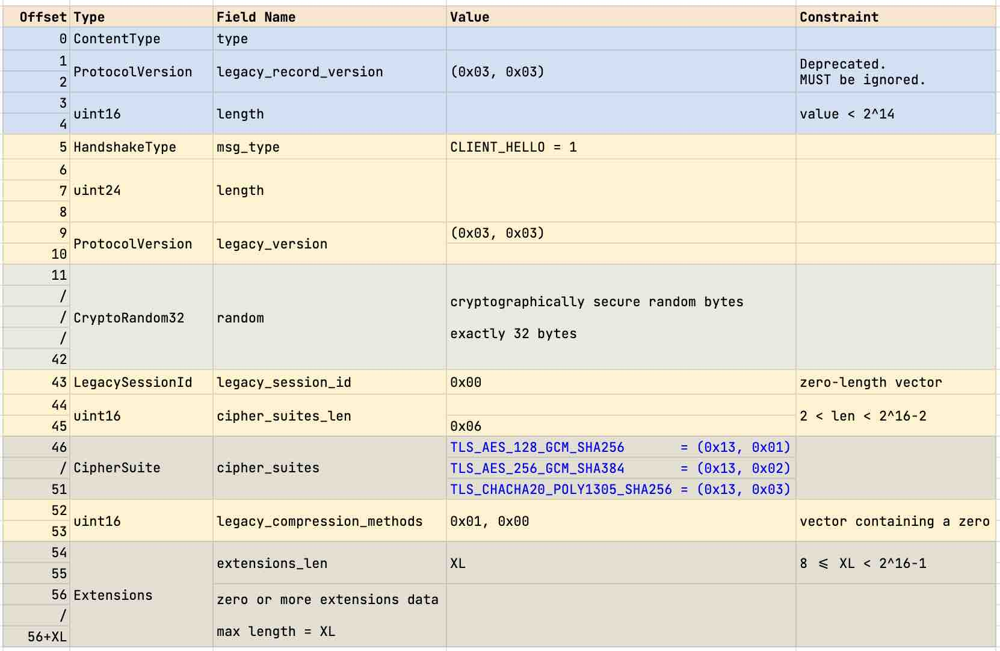
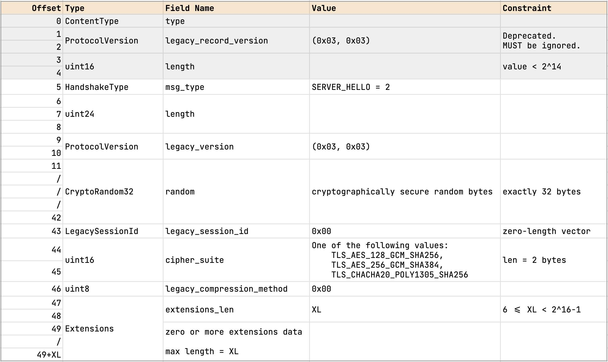
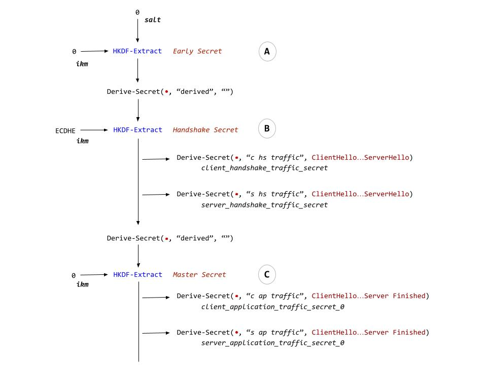

<head>
    <title>TLS 1.3 Handshake</title>
    <link rel="stylesheet" href="https://cdn.jsdelivr.net/npm/katex@0.16.11/dist/katex.min.css"
        integrity="sha384-nB0miv6/jRmo5UMMR1wu3Gz6NLsoTkbqJghGIsx//Rlm+ZU03BU6SQNC66uf4l5+" crossorigin="anonymous">

    <script defer src="https://cdn.jsdelivr.net/npm/katex@0.16.11/dist/katex.min.js"
        integrity="sha384-7zkQWkzuo3B5mTepMUcHkMB5jZaolc2xDwL6VFqjFALcbeS9Ggm/Yr2r3Dy4lfFg"
        crossorigin="anonymous"></script>

    <script defer src="https://cdn.jsdelivr.net/npm/katex@0.16.11/dist/contrib/auto-render.min.js"
        integrity="sha384-43gviWU0YVjaDtb/GhzOouOXtZMP/7XUzwPTstBeZFe/+rCMvRwr4yROQP43s0Xk" crossorigin="anonymous"
        onload="renderMathInElement(document.body);"></script>
</head>


## DICP - Part 1

### Flights and Message Encryption

A TLS flight consists of one or more messages sent in a sequence without 
waiting for response from the receiving endpoint. In a typical session, 
for example, we can relate messages and flights in a simple way:

```
    Flight     Message               Sender
   -----------------------------------------
      1      Client Hello            Client
      2      Server Hello            Server
      3      Change Cipher Spec      Server
      4      Encrypted Extensions    Server
             Certificate
             Certificate Verify
             Server Finished
      5      Client Finished         Client

```

A TLS server normally sends `Encrypted Extensions`, `Certificate`, 
`Certificate Verify`, and `Server Finished` messages in one flight.

Most servers encrypt individual plaintext messages and send each ciphertext 
in turn. The sequence of these ciphertext records represents a flight. A few 
servers, on the contrary, encrypt the entire sequence of plaintext messages 
into one ciphertext block, and send the ciphertext in one flight. In our 
tests, we have found "x.com:443" and "www.google.com:443" employ the latter
method for .


### Background
Virtually every online financial transaction is protected by Transport Layer
Security (TLS). Open Banking standards across the globe make TLS version 1.2
or above mandatory for participating entities. TLS is undoubtedly one of
the most widely deployed internet security protocol. More recent messaging 
protocol, MLS (RFC 9420, section-16.1), recommends all MLS messages 
to be transmitted over TLS 1.3.


### AEAD
Authenticated Encryption with Associated Data (AEAD) [Rog02] has emerged as 
being the right cryptographic tool for building secure channels. AEAD provides
both confidentiality and integrity guarantees for data.


### Stateful AEAD
[Requirements on AEAD Algorithm Specifications](https://datatracker.ietf.org/doc/html/rfc5116)

An Authenticated Encryption algorithm MAY incorporate internal state information that is maintained between invocations of the encrypt operation, e.g., to allow for the construction of distinct values that are used as internal nonces by the algorithm.  An AEAD algorithm of this sort is called stateful.  This method could be used by an algorithm to provide good security even when the application inputs zero-length nonces.

### AEADs and Secure Channel
In [Data Is a Stream: Security of Stream-Based Channels](https://eprint.iacr.org/2017/1191.pdf), Marc Fischlin et.al.,
note that while AEAD provides both confidentiality and integrity guarantees for data, on its own, AEAD does not constitute a secure channel. For example, in most practical situations, a secure channel should provide more than simple encryption of messages, but also guarantee detection of (and possibly recovery from) out-of-order delivery and replays of messages.


### The State Machine

In part 1 we will consider the implementation of a TLS 1.3 client program. 
We call this version of the client program *tlsc*. In TLS 1.3 parlance, 
*tlsc* implements 1-RTT handshake using ECDHE key exchange mode without 
client authentication. This characterization gives a specific structure 
to the interactions between *tlsc* and a TLS 1.3 compliant server. To see 
the shape of the interaction, refer to Figure 1 on page 11 of RFC 8446.
We will also use the state machines `A.1. Client` (page 120) and 
`A.2. Server` (page 121) in Appendix A.


    Client                              Server

    <Key Exchange>
        ClientHello
            + key_share
            + signature_algorithms
                            -------->
                                        <Key Exchange>
                                            ServerHello
                                                + key_share

                                        <Server Params>
                                            {EncryptedExtensions}

                                        <Auth>
                                            {Certificate}
                                            {CertificateVerify}
                                            {Finished}
                            <--------

    <Auth>
        {Finished}

    <App>
    [Application Data]    <------->     [Application Data]

`Figure 1 - Shape of 1-RTT Handshake without Client Authentication.`

While reading the diagram imagine that time progresses vertically downward
and interaction flows in the direction of arrows.

In presenting the diagram above, we have reused the notational convention
from RFC 8446 with one augmentation.

1. `+` indicates important extensions sent in the message.
2. `{}` shows messages protected using keys derived from a 
`[sender]_handshake_traffic_secret`.
3. `[]` indicates messages protected using keys derived from 
`[sender]_application_traffic_secrete_N`.
4. `<>` names a phase or a sub-protocol. This is our own notation;
this is not from RFC 8446.


Figure 1 shown above is a simplified version of Figure 1 from the RFC. 
We leave out *pre-shared key (PSK)* mode, and authentication messages, 
Certificate and CertificateVerify, on the client side.


In this document (`DICP - Part 1`), we will study the technical aspects of 
implementing the interactions shown in Figure 1. We will delve into the 
details of various cryptographic primitives used in each step of the 
interaction. We will try to reason why TLS 1.3 chooses to use cryptographic 
constructions in the fashion it does. We will also try to clarify and 
elaborate aspects where the text in the RFC is either cryptic or is not 
too helpful.


### The Handshake Protocol
The handshake (sub)protocol is the most important part of TLS.
The security guarantees of the entire session are established in the 
handshake stage.

Section 4 of RFC 8446 (about 54 pages of text) is entirely dedicated 
for describing the messages and interactions constituting handshake 
protocol. Even the appendices in the RFC discuss, at length, the security 
aspects of the handshake protocol.

 

### Key Exchange

Within the handshake protocol, *Key Exchange* is the first phase. 
In Figure 1 above, this includes two messages:

1. ClientHello
    - the very first message of the protocol.
    - describes cryptographic primitives and algorithms the client is 
        prepared to use in this session.
    - includes one or more ephemeral public keys for elliptic-curve 
        Diffie-Hellman exchange.
    - includes a 32 byte random number indicating client's session freshness.

2. ServerHello.
    - the last/final plaintext message of the handshake protocol.
    - indicates the cryptographic primitives and algorithms the 
        server has accepted.
    - includes server's public key for elliptic-curve Diffie-Hellman exchange.
    - includes a 32 byte random number indicating server's session freshness.

At the end of key exchange, the client and server establish a set of shared 
secrets used for encrypting (protecting) messages that follow. In addition, 
the client and server agree upon the cryptographic algorithms 
(aka ciphersuite) which will be in force for the rest of the session.


### Key Exchange Phase


Client sends `ClintHello` to the server:
<a id="xref-client-hello-spec"></a>

$$
    {\begin{array}{llll}
    \llbracket & & & \\
        & server\_name & {\larr} & {\rm\normalsize{SERVER\_NAME}} \\
        & {{handshake\_context}}       & {\larr} & client\_hello\_msg\\
        & {{cipher\_suite\_ids}} & {\larr} & [{cid_{1}, ..., cid_{j}}] \ \text{where} \ 1 \le j \le 5\\
        & {{key\_shares}}    & {\larr} & [(ecg_1, (sk^c_1, pk^c_1)), \\
        &&&                         \ \, ..., \\
        &&&                         \ \, (ecg_m, (sk^c_m, pk^c_m))] \ \text{where} \ 1 \le m\\
        & {{signature\_schemes}}    & {\larr} & {<}s_1, ..., s_n{>} {\hspace*{60mm}} \\
    \rrbracket & & & \\
    \end{array}}
$$

**ClientHello**



Server state after deriving its handshake secrets:
$$
    {\begin{array}{llll}
    \llbracket & & & \\
        & {handshake\_context}       & {\larr} & {\rm\normalsize{Concat}}(client\_hello\_msg, \\
        &&&                                        \hspace*{12mm} server\_hello\_msg)\\
        & {cipher\_suite\_id} & {\larr} & cid \ \rm{where} \ cid \in \{{\rm\normalsize{CH}}.cid_{1}, ..., {\rm\normalsize{CH}}.cid_{j}\}\\
        & {cipher\_suite} & {\larr} & {\rm\normalsize{CipherSuite}}(cid) \ \text{where} \ cid \in \{{\rm\normalsize{CH}}.cid_{1}, ..., {\rm\normalsize{CH}}.cid_{j}\}\\
        & {traffic\_secrets} & {\larr} & (hs, hts^s, hts^c) \\
        &&&                               {\rm{where}} \ hs \ \ \, = {\rm\normalsize{HandshakeSecret(...)}} \\
        &&&                               \hspace*{9mm}\ hts^s = {\rm\normalsize{ServerHandshakeTrafficSecret(...)}} \\
        &&&                               \hspace*{9mm}\ hts^c = {\rm\normalsize{ClientHandshakeTrafficSecret(...)}} \\
        & {server\_cert} & {\larr} & {\rm\normalsize{X509Cert}}(n, \ s) \\
        &&&                          \ \ \rm{where} \ n = {\rm\normalsize{CH}}.server\_name, \\
        &&&                          \ \ \hspace*{9mm} \ s \in \{{\rm\normalsize{CH}}.s_{1}, ..., {\rm\normalsize{CH}}.s_{n}\}\\
    \rrbracket & & & \\
    \end{array}}
$$

**ServerHello**



Client receives the server hello message, computes handshake secrets, and prepares for the traffic authentication sub-protocol. This is the client state at the beginning of the authentication phase:
$$
    {\begin{array}{llll}
    \llbracket & & & \\
        & {{handshake\_context}}       & {\larr} & {\rm\normalsize{Concat}}(client\_hello\_msg, \\
        &&&                                         \hspace*{12mm} server\_hello\_msg) \\
        & {{cipher\_suite\_id}} & {\larr} & {\rm\normalsize{SH}}.cid, \\
        & {{cipher\_suite}} & {\larr} & {\rm\normalsize{CipherSuite}}({\rm\normalsize{SH}}.cid) \\
        & {{traffic\_secrets}} & {\larr} & (hs, hts^s, hts^c)  {\hspace*{60mm}} \\
        &&&                               {\rm{where}} \ hs \ \ \, = {\rm\normalsize{HandshakeSecret(...)}} \\
        &&&                               \hspace*{9mm}\ hts^s = {\rm\normalsize{ServerHandshakeTrafficSecret(...)}} \\
        &&&                               \hspace*{9mm}\ hts^c = {\rm\normalsize{ClientHandshakeTrafficSecret(...)}} \\
    \rrbracket & & & \\
    \end{array}}
$$

$$
    {\begin{array}{l}
    (h^c, \, \{\tau_1,..,\tau_j\}, \, \{\kappa^c_{g_1},.., \kappa^c_{g_n}\}) {\hspace*{2.6in}}
    \bot \\
    \\
    {\hspace*{2.5cm}}{\large{\xrightarrow {client\_hello(sn, \, \{ g_1,..,g_m \}, \, \{s_1,..,s_i\}, \,
    \{\tau_1,..,\tau_j\},
    \, \{k^c_{g_1},.., k^c_{g_m}\}, \, r_c)}}} \\
    \end{array}}
$$


Server processes `ClientHello`, checks if it can support at least one DH group, validates the signature schemes indicated by the client, and the ciphersuite indicated in `ClientHello`. If it is satisfied, server selects the certificate, $\phi_s$, for the server name $sn$ indicated in `ClientHello`.

$$
    {\phi_s = sever\_cert(sn)}
$$

The server also chooses a ciphersuite, $\tau_i$:

$$
    {\tau \in \{ \tau_1,..,\tau_j\}}
$$


Next, server selects an elliptic curve group from the groups which client supports: $g_i \in  \{ g_1,..,g_m \}$. It produces a fresh Diffie-Hellman key pair $(\kappa^s_{g_i}, k^s_{g_i})$ where $\kappa^s_{g_i}$ is its private key (a secret), and $k^s_{g_i}$ is the public key. The secret is used to calculate DH shared secret, and the latter is shared with the client.

Server performs its part of ECDHE using client's key share and its own private key, producing DH shared secret:

$$
    \rho = ecdhe(\kappa^s_{g_i}, \, k^c_{g_i})
$$

Using only $\rho$ as the key material, server derives TLS handshake traffic secrets:

$$
    \chi = derive\_handshake\_traffic\_secrets(\rho)
$$

Now that the server has worked out cryptographic context, it prepares it's response, the `ServerHello` message. We name the plaintext bytes constituting this message as $h_s$ for short. It then creates an environment initialized with these components:

$$
    {E^{auth}_{s} = (h^c\cdot h^s, \, \chi, \, \phi_s, \, \tau)}
$$

Finally, it outputs the message. Note that the ephemeral public key component $k^s_{g_i}$ is part of the `ServerHello` message.

$$
    {\begin{array}{l}
    (h^c, \, \{\kappa^c_{g_1},.., \kappa^c_{g_n}\}, \, \{\tau_1,..,\tau_j\}) \hspace*{2.5in}
    (h^c\cdot h^s, \, \chi, \, \phi_s, \, \tau) \\
    \\
    {\hspace*{5cm}}{\large{\xleftarrow{server\_hello(g_i, \, \tau, \, k^s_{g_i}, \, r_s) \\}}}
    \end{array}}
$$

Client processes`ServerHello`, checks that the group $g_i$ selected by the server is one of the groups it supports:
$g_i \in \{ g_1,..,g_m \}$. Next, it runs ECDHE using server's ephemeral public key, $k^s_{g_i}$ and its own session private key $\kappa^c_{g_i}$, producing the exact same DH shared secret:

$$
    { \rho = ecdhe(\kappa^c_{g_i}, \, k^s_{g_i}) }
$$

Using only $\rho$ as the key material, client derives TLS handshake traffic
secrets:

$$
    {\chi = derive\_handshake\_traffic\_secrets(\rho)}
$$

Thanks to some neat elliptic-curve math, the client ends up with the exact
 same $\rho$ and $\chi$ as the server. The $\chi$ component is what the TLS
  spec calls `server_handshake_traffic_secret`.


By the end of this message exchange, the client is equipped to exchange 
encrypted and authenticated messages with the server. Therefore, the client
 initializes its session with the message context, session ciphersuite, 
 and the traffic secrets:

$$
    { E^{auth}_c = (h^c\cdot h^s, \, \tau, \, \chi) }
$$

Note that the message context is merely a concatenation of *plaintext slices* 
of ClientHello and ServerHello. The plaintext slices start from the sixth 
byte (offset 5 in the zero-based index). The first five bytes of ClientHello 
and ServerHello are data layer record headers. This is clearly shown in the 
two diagrams below. Record layer headers have a gray background while the 
plaintext fragments are shown in the clear.


#### Encrypted Extensions
As a part of handshake, the server is required to send the EncryptedExtensions
message immediately after the ServerHello message 
([section 4.3.1, page 60 of TLS](#xref-tls1.3-enc-ext)). This is the first 
encrypted message in the traffic. The server  encrypted using the key tucked
in the $\Chi$ component of the session


### Authentication Phase
In 1-RTT handshake, the server sends out the following three messages: 
`Certificate`, `Certificate Verify`, and `Finished`. These three messages 
constitute server authentication, certificate signing key confirmation, and 
ensuring handshake integrity, respectively. The client *has to processes* 
these messages in the same sequence. Each message carries incremental 
information necessary to verify the authenticity as well as the integrity of
the previous messages. We can summarize the information contained in each of 
these messages, and the actions client is required to carry out while 
processing these messages.

First, the `Certificate` message contains server's (non-empty) certificate 
chain. It is mandatory for servers to provide a list of X.509 certificates. 
Recall that the `server_name` extension in `ClientHello` identifies a server 
endpoint. The first certificate in the chain represents the endpoint 
identified by `server_name`. (Recall also that `sn` argument in 
[ClientHello](#xref-client-hello-spec) stands for `server_name`). 
The first certificate in the list, therefore, contains a public key to be 
used to verify the contents of the immediately following `CertificateVerify` 
message.


Second, the `Certificate Verify`


### Protecting Confidentiality, Integrity, and Authenticity of TLS traffic
In the handshake phase, each endpoint encrypts authentication messages 
exchanged with its peer. The data record representing the tamper-proof 
encrypted message (i.e., integrity protected ciphertext) has a two-layered 
conceptual structure. The outer layer uses a few bytes of metadata to protect
the integrity of the "inner plaintext", the handshake message data. The 
outer structure is called `TLSCiphertext` while the encrypted message 
data is `TLSInnerPlaintext`.

Peers exchange handshake messages as TLSCiphertext records. 
TLSCiphertext consists of a few bytes of metadata and a sequence of opaque
data bytes of the encrypted handshake message. The metadata in TLSCiphertext 
has a simple, fixed structure. It has three fields that consume only 5 bytes, 
the first three bytes of which store fixed values (23, 3, 3). The third field
encodes the length of the encrypted data. 

Section 5.2, page 89 of RFC 8446 defines two structures for 
representing protected data records. We reproduce the definitions with minor 
notational embellishments.  We indicate the offset of each field relative 
to the beginning of the structure. We use this information to define simple
algebraic relations on field-lengths. This is also useful in relating the 
byte-lengths of `TLSInnerPlaintext` and `TLSCiphertext`.

Consider the embellished version of `TLSCiphertext`:
```
    struct {
        // offset 0; size = 1; opaque_type = 23
        0:1  - ContentType opaque_type = application_data;

        // offset 1; size = 2, legacy_record_version = 0x0303
        1:2  - ProtocolVersion legacy_record_version = TLS_V1.2

        // offset 3; size = 2; 21 < length < 2^14 + 256
        3:2  - uint16 length;

        // offset 5; size = length; encrypted_record:u8[length]
        5:length - opaque encrypted_record[TLSCipherText.length];
    } TLSCiphertext;
    // sizeof(TLSCiphertext) = 5 + length
```

The same can be visualized as horizontally laid out sequence of bytes:

```
                            TLSCipherText Record

    0    1    2    3    4    5    6                                  5+length
    +----+----+----+----+----+----+----+--*--*----+----+---*--*-+----+
    | 23 | 0x0303  |  length |            encrypted_record           |
    +----+----+----+----+----+----+----+--*--*----+----+---*--*-+----+
    <------- 5 bytes ------->|<------------ ciphertext ------------->

```

Recalling that only AEAD algorithms are used for encrypting the records, 
we name parts of the TlsCipherText record by their roles. We will show the 
two parts of `encrypted_record`: the `encrypted data` and the AEAD MAC/Tag.
We use `ipl` to mean `inner plaintext length`, the meaning of which will 
be made clear in the next section:

```
                TLSCipherText Record showing AEAD parts

    0    1    2    3    4    5    6                    5+ipl         5+length
    +----+----+----+----+----+----+-----*/-/*----+----+-----*/-/*----+
    | 23 | 0x0303  |  length |     encrypted data     |      MAC     |
    +----+----+----+----+----+----+-----*/-/*----+----+-----*/-/*----+
    <--- Additional Data --->|<-- TLSInnerPlainText -->|<- AEAD Tag ->

    |<---------------------->|<------------------------------------->|
            AAD                            AEAD output
         (5 bytes)                      ('length' bytes)
                                           ciphertext

```

Since the AEAD algorithms used in TLS 1.3 produce a MAC of length 128 bits 
(16 bytes), we can render more details in the diagram:

```
                TlsCipherText Record showing AEAD parts

    0    1    2    3    4    5    6                    5+ipl         5+length
    +----+----+----+----+----+----+-----*/-/*----+----+-----*/-/*----+
    | 23 | 0x0303  |  length |      Encrypted Data    |      MAC     |
    +----+----+----+----+----+----+-----*/-/*----+----+-----*/-/*----+
    <--- Additional Data --->|<-- TLSInnerPlainText -->|<- AEAD Tag ->
                                    ('ipl' bytes)         (16 bytes)
    |<---------------------->|<------------------------------------->|
            AAD                            AEAD output
         (5 bytes)                      ('length' bytes)
                                           ciphertext

```

Therefore, $\, length = ipl + 16$.

RFC 8446 also requires that  $\, length \lt 2^{14} + 256$, and so we have: 
$\,(ipl + 16) \lt (2^{14} + 256)$.

Additionally, RFC 8446 states: `An endpoint that receives a record that 
exceeds this limit MUST terminate the connection with a "record_overflow" 
alert.`

### TlsInnerPlaintext
This structure holds the plaintext which is to be protected. The plaintext 
may be a handshake message fragment or raw bytes of the application data. 
It holds handshake message in the authentication phase, and subsequently, 
post-handshake, it holds application data exchanged by the peers.

```
    struct {
        // Plaintext handshake message (or application data).
        // PL stands for plaintext length.
        // offset 0; size = PL;
        0:PL - opaque content[TLSPlaintext.length];

        // CT stands for ContentType.
        // offset PL; size = 1;
        // type = 22 if handshake, and type = 23 if application_data
        PL:1 - ContentType type;

        // ZL stands for zero padding length.
        // offset PL+1; size = ZL; 0 <= ZL.
        PL+1:ZL  - uint8 zeroes[ZL];
    } TLSInnerPlaintext;
    // sizeof(TLSInnerPlaintext) = IPL = PL + 1 + ZL
    // sizeof(TLSInnerPlaintext) = (TLSCiphertext.length - 16) because length(AEAD MAC) = 16
```

In the following discussion we will use PL to mean the size of plaintext, 
in bytes. For brevity, we use CT for ContentType.

In TLSInnerPlaintext, the first field named `content` holds the plaintext 
bytes. The size of this array is PL (bytes). TLS does not allow zero length 
`content` field for handshake and alert messages.

The next field `type` holds the content type of the plaintext record. It 
denotes the `ContentType` of the message in `content` field. CT will have 
different values depending on the message or data being protected. Thus,

```
        CT = 21 - an alert message,
        CT = 22 - one of the following handshake messages
                    - encrypted_extensions
                    - certificate
                    - certificate_verify
                    - finished
                    - new_session_ticket
        CT = 23 - application specific data
            (i.e, HTTP request/response payload)
```

TLS 1.3 allows encrypted records to be padded with zeroes as long as the 
total size of TLSInnerPlaintext record doesn't exceed 2^14 + 1 bytes. When 
the sender inflates the size of an encrypted record, observers cannot tell 
the actual size of the plaintext. It is obvious padding increases record 
size, and may adversely impact overall performance.

Section 5.4 of RFC 8446 describes many aspects of record padding. In our 
tests, we will see that most HTTP servers do not pad either handshake 
records or application data records.

The following diagram shows the structure of TLSInnerPlaintext without 
padding zeroes, which is the most common case.

```

    0    1    2    3                            PL   PL+1
    +----+----+----+----/-*--*-/-+----+----+----+----+
    |             Handshake Message             | CT |
    +----+----+----+----/-*--*-/-+----+----+----+----+
    <---------------  Plaintext  -------------->|
                        (PL bytes)

    |<---------------------------------------------->|
                    TlsInnerPlaintext
                      (PL+1 bytes)

            TlsInnerPlaintext without padding

```

TlsInnerPlaintext with arbitrary zero padding at the end of the data block 
may be visualized thus:

```
    
    0    1    2    3                           PL  PL+1              PL+1+ZL
    +----+----+----+---*---*---+----+----+----+----+--*-----*----*---+
    |              Handshake Message          | CT |      zeroes     |
    +----+----+----+---*---*---+----+----+----+----+-*------*----*---+
    <--------------- Plaintext -------------->|    |<- Optional Pad ->
                    (PL bytes)                          (ZL bytes)

    |<-------------------------------------------------------------->|
                            TlsInnerPlaintext

            TlsInnerPlaintext with arbitrary-sized zero padding

```

The following diagram shows how a TlsInnerPlaintext record without
zero-padding is encrypted with an AEAD algorithm, and the encrypted
message payload is 

```

                              TlsInnerPlaintext (PL+1 bytes)
                   |<-------------------------------------------->|
                   +----+----+----+--/-*-*-/--+----+----+----+----+
                   |            Handshake Message            | CT |
                   +----+----+----+--/-*-*-/--+----+----+----+----+
                    \                                             /
                     \_______                             _______/
                             \     (AEAD ENCRYPTION)     /
                              \                         /
     +----+----+----+----+----+----+-----*/-/*-----+----+----*/-/*----+
     | 23 | 0x0303  |  length |encrypted message payload|     MAC     |
     +----+----+----+----+----+----+-----*/-/*-----+----+----*/-/*----+
     <--- Additional Data --->|<-- TLSInnerPlainText -->|<- AEAD Tag ->
                                     ('ipl' bytes)         (16 bytes)
     |<---------------------->|<----------------------->|<----------->|
                                          
```

### TlsCiphertext
TLS 1.3 employs only Authenticated Encryption with Associated Data (AEAD) 
ciphers. AEADs simultaneously protect confidentiality of the plaintext, 
and the authenticity and integrity of ciphertext. In other words, with the 
AEADs required by TLS 1.3, an attacker will not be able to learn about the 
plaintext or the encryption key even if the attacker has access to all 
ciphertexts exchanged between the peers. At the same time, AEAD ciphers 
will be able to detect if either ciphertext or the MAC has been tampered 
or altered in transit. Practical AEADs combine a secure cipher with a 
strong MAC. Their composition has been proved to provide highest levels
of security.

TLS 1.3 defines 5 AEAD algorithms for record protection:

```
    AES_128_GCM         - MUST implement this AEAD algorithm.
    AES_256_GCM         - SHOULD implement this AEAD algorithm.
    CHACHA20_POLY1305   - SHOULD implement this AEAD algorithm.
    AES_128_CCM
    AES_256_CCM
```

In `tlsc`, we support the first three algorithms from this list which 
includes the mandatory AES_128_GCM.


### Key Derivation
The server processes the ClientHello message and determines the ciphersuite 
for the session. The server responds with the ServerHello message which 
includes its 
*key share*, which is server's ephemeral Diffie-Hellman share. In `tlsc`, 
ClientHello contains two shares, each in an EC group: X25519 and secp256r1.
These are the only two `supported_groups` in `tlsc`.





## References

<a id="xref-tls1.3-enc-ext"></a>
The Transport Layer Security (TLS) Protocol Version 1.3. https://www.rfc-editor.org/rfc/rfc8446.html#section-4.3.1