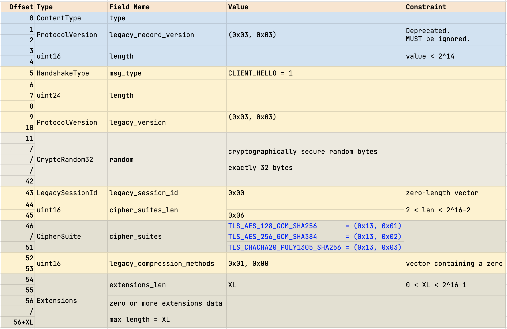

## DICP - Part 1

### Overview

In part 1 we will consider the implementation of a TLS 1.3 client program. We call this version of the client program *tlsc*. In TLS 1.3 parlance, *tlsc* implements 1-RTT handshake using ECDHE key exchange mode without client authentication. This characterization gives a specific structure to the interactions between *tlsc* and a TLS 1.3 compliant server. To see the shape of the interaction, refer to Figure 1 on page 11 of RFC 8446. We will also use the state machines `A.1. Client` (page 120) and `A.2. Server` (page 121) in Appendix A.

    Client                              Server

    <Key Exchange>
        ClientHello
            + key_share
            + signature_algorithms
                            -------->
                                        <Key Exchange>
                                            ServerHello
                                                + key_share

                                        <Server Params>
                                            {EncryptedExtensions}

                                        <Auth>
                                            {Certificate}
                                            {CertificateVerify}
                                            {Finished}
                            <--------

    <Auth>
        {Finished}

    <App>
    [Application Data]    <------->     [Application Data]    

`Figure 1 - Shape of 1-RTT Handshake without Client Authentication.`

While reading the diagram imagine that time progresses vertically downward and interaction flows in the direction of arrows.

In presenting the diagram above, we have reused the notational convention from RFC 8446 with one augmentation.
    
1. `+` indicates important extensions sent in the message.
2. `{}` shows messages protected using keys derived from a `[sender]_handshake_traffic_secret`.
3. `[]` indicates messages protected using keys derived from `[sender]_application_traffic_secrete_N`.
4. `<>` names a phase or a sub-protocol. This is our own notation; this is not from RFC 8446.

Figure 1 shown above is a simplifiesd version of Figure 1 from the RFC. We leave out *pre-shared key (PSK)* mode, and authentication messages, Certificate and CertificateVerify, on the client side. 

In this document (`DICP - Part 1`), we will study the technical aspects of implementing the interactions shown in Figure 1. We will delve into the details of various cryptographic primitives used in each step of the interaction. We will try to reason why TLS 1.3 chooses to use crytographic constructions in the fashion it does. We will also try to clarify and elaborate aspects where the text in the RFC is eiher cryptic or is not too helpful.

### The Handshake Protocol
The handshake (sub)protocol is the most important part of TLS. Undoubtedy, the designers spent significant effort in improving its efficiency compared to TLS 1.2. Most of the security guarantees of TLS is deined by the handshake protocol. Section 4 of RFC 8446 (about 54 pages of text) is entitely dedicated for describing the messages and interactions constituting handshake protocol. Even the appendices in the RFC discuss, at length, the security aspects of the handshake protocol.

#### Key Exchange

Within the handshake protocol, *Key Exchange* is the first phase. In Figure 1 above, this includes two messages:

1. ClientHello
    - the very first message of the protocol.
    - describes cryptographic primitives and algorithms the client is prepared to use in this session.
    - includes one or more ephemeral public keys for elliptic-curve Diffie-Hellman exhange.
    - includes a 32 byte random number indicating client's session freshness.

2. ServerHello.
    - the last/final plaintext message of the handshake protocol.
    - indicates the cryptographic primitives and algorithms the server has accepted.
    - includes server's public key for elliptic-curve Diffie-Hellman exhange.
    - includes a 32 byte random number indicating server's session freshness.

At the end of key exchange, the client and server establish a set of shared secrets used for encrypting (protecting) messages that follow. In addition, the client and server agree upon the cryptographic algorithms (aka ciphersuite) which will be in force for the rest of the session.

#### Server Parameters
This message immediately follows ServerHello, and it indicates server's preferences. The server may indicate that the client needs to authenticate (using client's certificate) 

#### Authentication
indicates that server authentication uses three messages: Certificate, CertificateVerify, and Finished.

#### ClientHello

